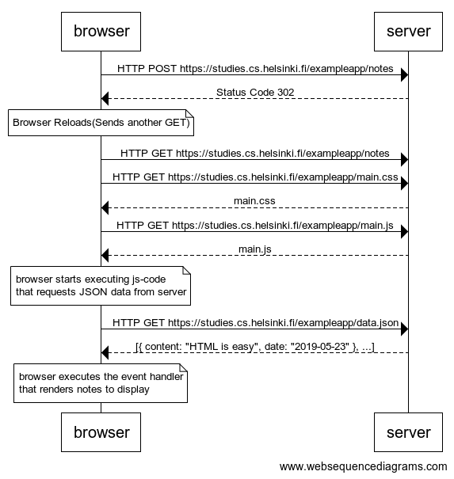
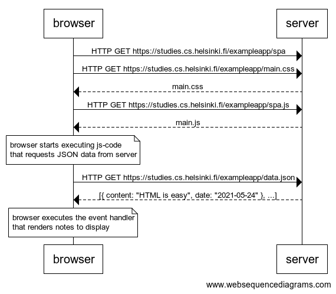
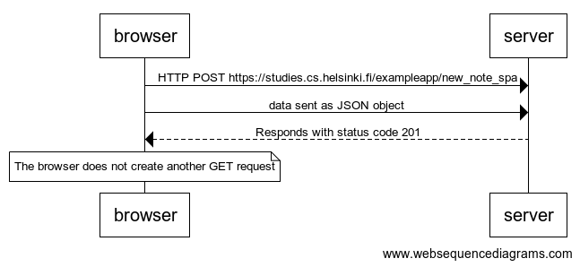

# [Fundamentals of Web apps](https://fullstackopen.com/en/part0/fundamentals_of_web_apps)

## 0.4: new note

Create a diagram depicting the situation where the user creates a new note on page https://fullstack-exampleapp.herokuapp.com/notes by writing something into the text field and clicking the submit button.

### Solution

## 0.5: Single page app

Create a diagram depicting the situation where the user goes to the single page app version of the notes app at https://fullstack-exampleapp.herokuapp.com/spa.

### Solution

## 0.6: New note on Single page app

Create a diagram depicting the situation where user creates a new note using the single page version of the app.

### Solution

